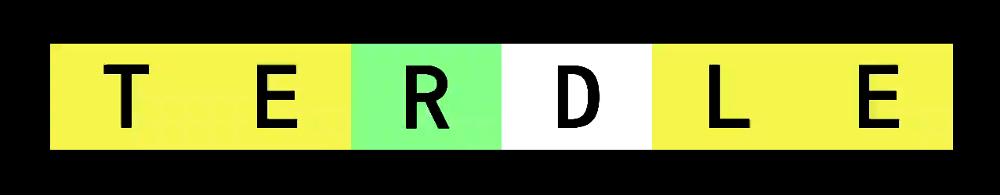

# TERDLE

## Installation

```bash
git clone https://github.com/biz-cochito/terdle.git
cd terdle
uv sync
```

Run the game with `uv run main.py`.

## To do

### Game logic

- [x] correct handling of duplicate letters
- [x] restrict guesses to valid words
- [x] separate word lists for valid guesses and potential target words

### UI

- [x] start menu
- [x] title animation
- [x] display available letters
- [ ] center output within the terminal
- [ ] animate winning guess
- [ ] highlight active selection in start menu
- [x] replace explicit references to colors with "style_correct", etc.
- [ ] replace repeating "Attempt X/6: " with a single line that gets updated

### Input

- [x] allow cursor movement with arrow keys on guess input
- [ ] "?" key to show keyboard shortcuts
- [x] kb shortcut to exit the game
- [x] kb shortcut to return to the main menu
- [ ] kb shortcut to redraw UI

### Settings and configuration

- [ ] color themes
- [ ] choose word length
- [ ] toggle animations
- [ ] disable tutorial message

### Stats

- [ ] win/loss ratio
- [ ] current winning streak
- [ ] longest winning streak
- [ ] guess distribution
- [ ] average guesses
- [ ] total games played
